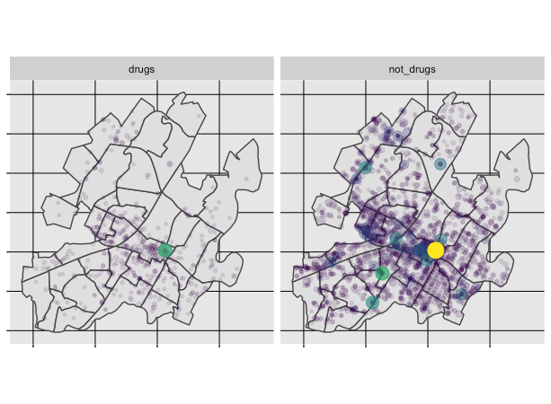

```{r setup, include=FALSE}
# knitr::opts_chunk$set(echo = FALSE)
library(magrittr)
library(tidyverse)
library(viridis)
```

## Why drug crime?

- Community impact
- Cooler than parking tickets
- Easy access to ~31,000 observations


## Goals of this talk

- Show the spatial distribution of crime in the city
- Get someone excited about R or open data
- Provide a tidyverse template for analyzing raw police reports


## Where is crime happening?
<!--  -->

```{r crime_map, echo=FALSE, cache=TRUE}
my_github <- "https://github.com/NathanCDay/cville_crime/raw/master/data/"
crime_counts <- readRDS(gzcon(url(paste0(my_github,"crime_counts_sf.RDS"))))
census <- readRDS(gzcon(url(paste0(my_github,"census_sf.RDS"))))

ggplot(crime_counts) +
    geom_sf(data = census) +
    geom_sf(aes(size = n, color = n, alpha = n)) +
    scale_color_viridis() +
    facet_wrap(~drug_flag) 
```


## Most frequent addresses
Top 3 address for drug crime and not drug crime
```{r most_frequent, echo = TRUE, cache=TRUE}
arrange(crime_counts, -n) %>% group_by(drug_flag) %>% slice(1:3)
```

The police station's address is 606 E Market Street....

## What is going on at the police station?

"...when individuals walk in to the police department to file a report the physical address of the department (606 E Market Street) is often used in that initial report if no other known address is available at the time. This is especially true for incidents of found or lost property near the downtown mall where there is no true known incident location. The same is true for any warrant services that result in a police report occurring at the police department." - CPD response


## Test if the proportions are different:

```{r police_station_proportions, echo = TRUE, cache=TRUE}
station_props <- arrange(crime_counts, -n) %>%
    group_by(drug_flag) %>%
    add_count(wt = n) %>%
    slice(1)

with(station_props, prop.test(n, nn))
```

## Aggregate into areas

Census blocks make a lot of sense becuase:

- Tons of data in Census and American Community Surveys
- Reputable source with code books and APIs
- Easy to access in R via ODP and `library(tidycensus)`


## Doing it
```{r census_pop, echo = TRUE, warning=FALSE, message=FALSE, fig.height=4}
census <- geojsonio::geojson_read("https://opendata.arcgis.com/datasets/e60c072dbb734454a849d21d3814cc5a_14.geojson",
                                  what = "sp") %>% sf::st_as_sf()

ggplot(census) +
    geom_sf(aes(fill = Population)) +
    scale_fill_viridis()
```


## 

